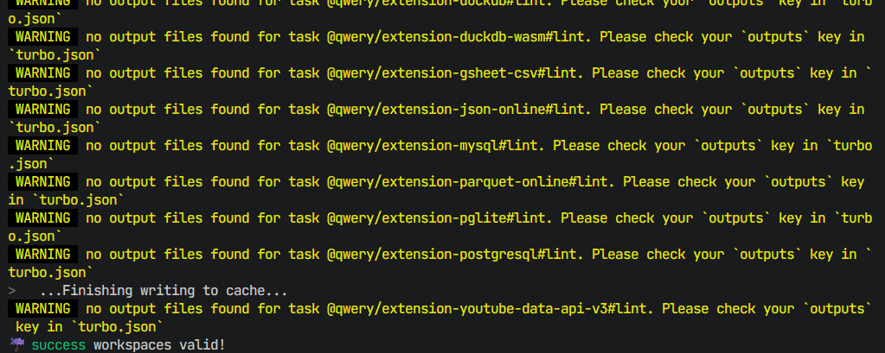
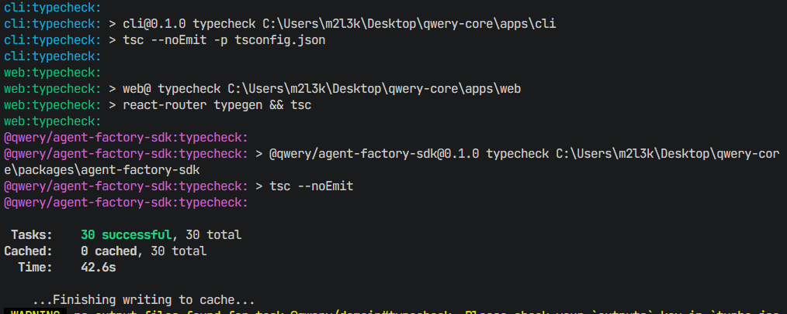

# Local LLM Integration (llama.cpp)

This repository is configured to run with a fully local LLM using `llama.cpp` via its OpenAI-compatible API.

## Local LLM Used

- Runtime: `llama.cpp` (`llama-server` OpenAI-compatible mode)
- Qwery provider id: `local` (aliases: `llama.cpp`, `llama-cpp`, `llamacpp`)
- Default model string: `llamacpp/default` (`packages/agent-factory-sdk/src/services/model-resolver.ts:32-34`)
- Model id: `Meta-Llama-3.1-8B-Instruct-Q4_K_M`

## How It Works

- Qwery resolves a model from a `provider/model` string.
- When the provider is `local` / `llamacpp` / `llama.cpp`, Qwery creates a provider that speaks OpenAI-compatible HTTP to your local `llama-server` (`packages/agent-factory-sdk/src/services/model-resolver.ts:50-91`, `packages/agent-factory-sdk/src/services/models/llamacpp-model.provider.ts:12-49`).

## Setup Instructions

### 1) Download a GGUF model

Download any GGUF model you want (example path):

- `C:\models\your-model.gguf`

Do not add the model file to this repository.

### 2) Start `llama-server`

Start `llama.cpp` in OpenAI-compatible mode (example):

```bash
llama-server -m C:\models\your-model.gguf --host 127.0.0.1 --port 8080
```

Verify the server is responding:

- `http://127.0.0.1:8080/v1/models`
- UI (chat): `http://127.0.0.1:8080/#/chat/5a7a700e-cf3d-4319-8283-a2fe2e41706f`

Copy the model id returned by `/v1/models` and use it as `LLAMACPP_MODEL`.

### 3) Configure environment variables

Set environment variables for the app you run (CLI and/or web). Example:

```bash
QWERY_DEFAULT_MODEL=local/default
LOCAL_LLM_BASE_URL=http://127.0.0.1:8080/v1
LOCAL_LLM_MODEL=Meta-Llama-3.1-8B-Instruct-Q4_K_M
```

Optional aliases supported by the resolver:

- `LOCAL_LLM_BASE_URL` (alias of `LLAMACPP_BASE_URL`)
- `LOCAL_LLM_MODEL` (alias of `LLAMACPP_MODEL`)

### 4) Run the CLI

```bash
pnpm --filter cli build
cd apps/cli
node dist/index.js
```

The example `.env` template is in `apps/cli/.env.example`.

### 5) Build the web app and extensions

```bash
pnpm --filter web build
pnpm extensions:build
```

## Environment Variables Added / Used

- `QWERY_DEFAULT_MODEL`: model string in `provider/model` format, defaults to `llamacpp/default`
- `LOCAL_LLM_BASE_URL`: base URL of the OpenAI-compatible server, defaults to `http://127.0.0.1:8080/v1`
- `LOCAL_LLM_MODEL`: model id returned by `GET /v1/models` on your `llama-server`
- `LLAMACPP_API_KEY`: optional; typically not needed for local llama.cpp

## Files Modified

- `apps/web/vitest.config.ts`
- `packages/ui/vitest.config.ts`
- `packages/extensions-sdk/vitest.config.ts`
- `packages/features/playground/vitest.config.ts`
- `tooling/extensions/build.js`
- `apps/cli/README.md`
- `README.md`

## Build Confirmation

The following commands are verified locally after the changes:

- `pnpm --filter web build`
- `pnpm extensions:build`
- `pnpm lint`
- `pnpm typecheck`





## Assumptions

- You run `llama-server` locally and point Qwery to it via `LLAMACPP_BASE_URL`.
- You choose and download the GGUF model yourself, and set `LLAMACPP_MODEL` to the model id your server reports.
